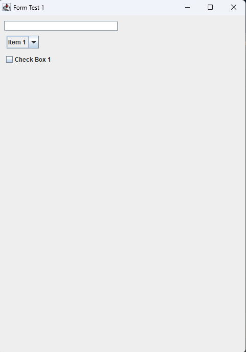
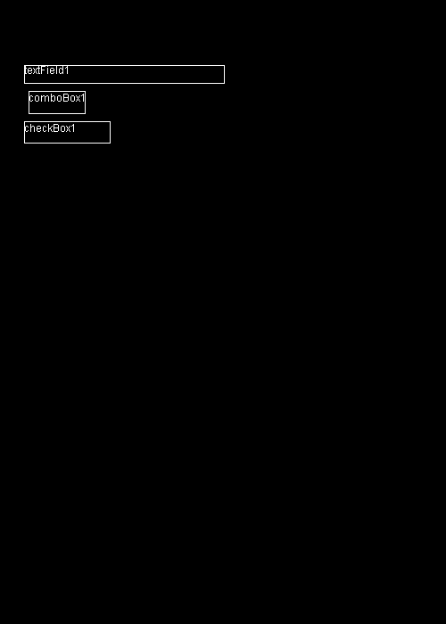

# Concept

Demonstrates the potential ability to generate form navigation mappings from a swing based form.
Concept could be extended for technologies beyond swing.

## Current Generation Logic
Test form actual:



Mapping - understood context.



Generated python code:
```python
from robot.api.deco import keyword

class FormTest1Model:

    @keyword
    def create_Form_Test_1_model(self, textField1:str="", comboBox1:str="", checkBox1:str="") -> dict:
        return locals().items()
```

```robotframework
*** Settings ***
Documentation    DO NOT MANUALLY MODIFY THIS FILE. IT IS GENERATED BY THE FORM MAPPING TOOL
...              A generated resource file for managing resources for Form Test 1. To learn how to update
...              this file, please refer to the README.md in the repository x,y,z


*** Keywords ***

Update {$formName} Form
        [Arguments]    ${model}
        [Documentation]    Used to update data on the form Form Test 1. NOTE this keyword will have a reference of each component, including
        ...                the components that are readonly. Understanding the state of the field must be managed as part of the test.
        ...                The intended use of this keyword is with the python model class FormTest1Model.
        ...                Example Usage:
        ...                ${form_model}=    Create Form Test 1 Model
        ...                Update Form Test 1 Form    ${form_model}
        # TODO Incorporate form location into calculation
        Click Location On Form    139    83
        Enter Text    ${form_model}["textField1"]

        # TODO Incorporate form location into calculation
        Click Location On Form    63.5    114.5
        Enter Text    ${form_model}["comboBox1"]

        # TODO Incorporate form location into calculation
        Click Location On Form    75    148
        Enter Text    ${form_model}["checkBox1"]

Read Form Test 1 textField1 Field
        [Documentation]    Used to read the value of the textField1 field on the Form Test 1 form.
        # TODO - Incorporate form location into calculation
        Double Click Location On Form    139    83
        Copy Selected Text To Clipboard
        ${value}=    Get Clipboard Value
        Clear Clipboard
        [Return]    ${value}

Read Form Test 1 comboBox1 Field
        [Documentation]    Used to read the value of the comboBox1 field on the Form Test 1 form.
        # TODO - Incorporate form location into calculation
        Set Region   37    107    43    20
        ${value}=    Read Text With OCR
        Reset Region
        [Return]    ${value}

Read Form Test 1 checkBox1 Field
        [Documentation]    Used to read the value of the checkBox1 field on the Form Test 1 form.
        # TODO - Incorporate form location into calculation
        Set Region   32    141    76    19
        ${value}=    Exits  selectedCheckbox.png
        Reset Region
        [Return]    ${value}
```